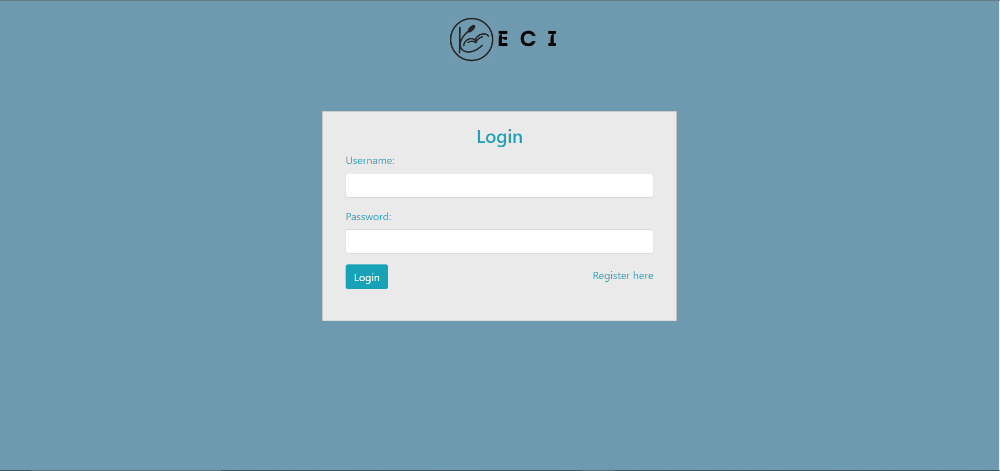

# 

##

## **GROUP:**

Lâm Hoàng Gia Huy - SE173548

##

# **Requirements**

### _I. Name of system_

    ECI -  E-Book Citrus Library

### _II. Purpose of the system_

- People can share and upload their books to provide a platform for individuals to share their knowledge and ideas with a wider reader.
- Free to share interesting things about books with everyone.
- It allows for the democratization of information and makes reading more accessible and convenient for everyone.
- By creating a community of readers and writers, an e-book library promotes literacy and lifelong learning.
- It also provides an opportunity for individuals to discover new authors and topics that they may not have encountered otherwise.
  > Overall, an e-book library helps to foster a love of reading and learning while promoting a culture of sharing and collaboration.

### _III. User Objects_

- It's for all readers from old to young. Here is a place that has every type of e-book - suitable for each age, each field.

### _IV. Function_

- User registration and login system: Users can create their own accounts and log in to access the library's features.
- Book uploading system: Users can upload their own Ebooks to the library's collection.
- Book categorization and tagging system: Books can be categorized by genre, author, title, and other relevant information. Tags can also be added to books to make them easier to find.
- Book search function: Users can search for books by title, author, or keywords.
  - Search for an e-book by name or category
  - View ebook by category
  - View image and details for each ebook
  - Add to cart from the detail or search page
- Book preview system: Users can preview a portion of the book before deciding to download.
- Book recommendation system: Users can receive personalized book recommendations based on their reading history and preferences.
- Social features: Users can interact with each other through comments, reviews, and ratings.
- User profile system: Users can create their own profiles and showcase their reading history, favourite books, and other information.
- Administrative features: Administrators can manage the library's collection, user accounts, and other aspects of the platform.

# **WIREFRAME**

- Main Page
  

- Login Page
  

- Register Page
  

- Book Detail
  

- Search Page
  

# **SITEMAP**

# **DATABASE MODEL**

